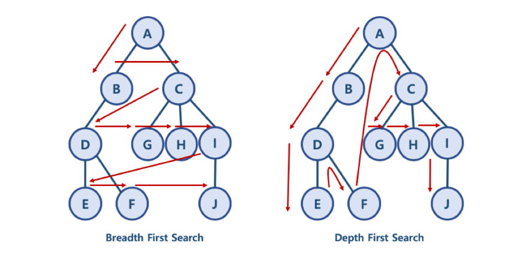

# 너비 우선 탐색 (BFS) / 깊이 우선 탐색 (DFS)

1. BFS, DFS
- 대표적인 그래프 탐색 알고리즘
- 여러 개의 정점이 연결되어 있는 형태로 나올 때 활용
    - 너비 우선 탐색 (BFS) : 같은 레벨에 있는 노드들을 먼저 탐색
    - 깊이 우선 탐색 (DFS) : 자식 노드들을 먼저 탐색하는 방식

2. BFS
- 자료구조 Queue를 이용함
- need_visit 큐와 visited 큐가 필요함. visited 큐는 list로 간단히 구현
- 노드 수를 V, 간선 수를 E라고 했을 때 while need_visit 는 V+E번 만큼 수행, 즉, 일반적인 BFS에서 시간복잡도는 O(V+E)

3. DFS
- 자료구조 Stack과 Queue를 이용함
- need_visit 스택과 visited 큐가 필요함. visited 큐는 역시 list로 구현 가능
- 시간복잡도 또한 BFS와 O(V+E)로 동일