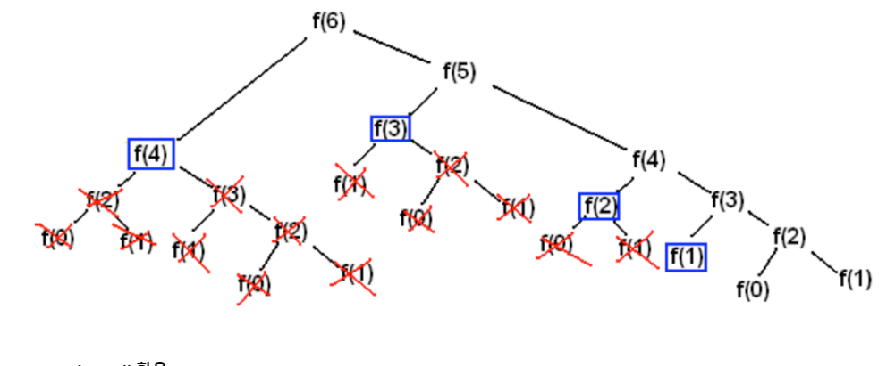

# 동적계획법 (DP)

- 상향식 접근법, 가장 최하위 해답을 구한 후, 그것을 저장하고, 해당 결과값을 이용해서 상위 문제를 풀어간다.
- **메모이제이션** 기법을 사용함 (이전에 계산한 값을 저장하여 다시 계산하지 않도록 하는 것)
- DP 문제를 풀기 위해서는 점화식 (인접한 항들 사이의 관계식)을 세워야 한다.
- 피보나치 수열처럼, 부분 문제는 중복되어 재활용된다.

